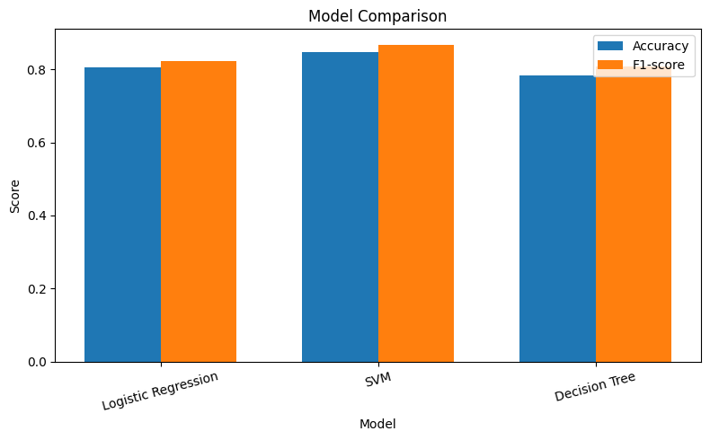
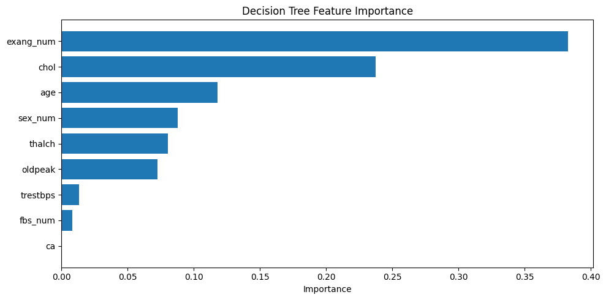
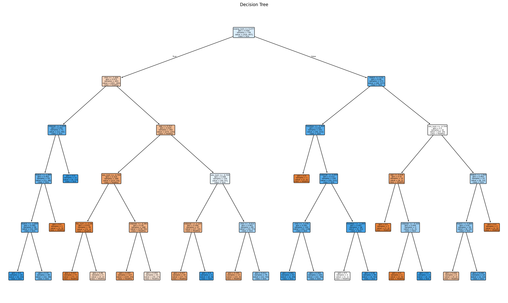

# Отчёт по лабораторной работе

## Тема: Сравнение моделей классификации для прогнозирования сердечных заболеваний

---

## 1. Описание задания

### 1.1 Цель работы
Сравнить качество трёх моделей классификации (логистической регрессии, SVM и дерева решений) для предсказания наличия сердечного заболевания у пациента на основе медицинских показателей.

### 1.2 Задачи работы
1. Загрузить и подготовить датасет Heart Disease UCI
2. Выполнить предобработку данных (пропуски, кодирование, масштабирование)
3. Разделить выборку на обучающую и тестовую (train_test_split)
4. Обучить модели:
   - Логистическую регрессию
   - SVM (Support Vector Machine)
   - Дерево решений
5. Оценить качество моделей по метрикам Accuracy и F1-score
6. Сравнить результаты моделей
7. Построить график важности признаков для дерева решений
8. Визуализировать дерево решений в текстовом виде

### 1.3 Используемые метрики

| Метрика | Описание |
|---------|----------|
| Accuracy | Доля правильных ответов |
| F1-score | Гармоническое среднее точности и полноты |

### 1.4 Исходные данные
- **Источник:** Kaggle — Heart Disease UCI
- **Размер:** 920 записей, 16 столбцов
- **Целевая переменная:** `num` (0 — здоров, 1-4 — болен)

### 1.5 Признаки для обучения

| Признак | Описание |
|---------|----------|
| age | Возраст |
| trestbps | Артериальное давление в покое |
| chol | Уровень холестерина |
| thalch | Максимальный пульс |
| oldpeak | Депрессия ST segment |
| ca | Количество крупных сосудов |
| sex_num | Пол (1 — мужчина, 0 — женщина) |
| fbs_num | Сахар в крови > 120 (1 — да, 0 — нет) |
| exang_num | Стенокардия при нагрузке (1 — да, 0 — нет) |

---

## 2. Текст программы

```python
import pandas as pd
import numpy as np
import matplotlib.pyplot as plt
from sklearn.model_selection import train_test_split
from sklearn.preprocessing import StandardScaler
from sklearn.linear_model import LogisticRegression
from sklearn.svm import SVC
from sklearn.tree import DecisionTreeClassifier, plot_tree, export_text
from sklearn.metrics import accuracy_score, f1_score, classification_report

df = pd.read_csv('/kaggle/date/heart_disease_uci.csv')
df['target'] = (df['num'] > 0).astype(int)

numerical_features = ['age', 'trestbps', 'chol', 'thalch', 'oldpeak', 'ca']

X = df[numerical_features].copy()

for col in numerical_features:
    if X[col].isnull().sum() > 0:
        X[col].fillna(X[col].median(), inplace=True)

df['fbs_clean'] = df['fbs'].fillna(False)
X['fbs_num'] = df['fbs_clean'].astype(int)

df['exang_clean'] = df['exang'].fillna(False)
X['exang_num'] = df['exang_clean'].astype(int)

df['sex_clean'] = df['sex'].fillna('Male')
X['sex_num'] = (df['sex_clean'] == 'Male').astype(int)

if X['ca'].isnull().sum() > 0:
    X['ca'].fillna(X['ca'].median(), inplace=True)

y = df['target'].copy()

scaler = StandardScaler()
X_scaled = scaler.fit_transform(X)

X_train, X_test, y_train, y_test = train_test_split(
    X_scaled, y, test_size=0.2, random_state=42, stratify=y
)

log_reg = LogisticRegression(max_iter=1000, random_state=42)
log_reg.fit(X_train, y_train)
y_pred_log = log_reg.predict(X_test)

svm_model = SVC(kernel='rbf', random_state=42)
svm_model.fit(X_train, y_train)
y_pred_svm = svm_model.predict(X_test)

dt_model = DecisionTreeClassifier(random_state=42, max_depth=5)
dt_model.fit(X_train, y_train)
y_pred_dt = dt_model.predict(X_test)

accuracy_log = accuracy_score(y_test, y_pred_log)
f1_log = f1_score(y_test, y_pred_log)

accuracy_svm = accuracy_score(y_test, y_pred_svm)
f1_svm = f1_score(y_test, y_pred_svm)

accuracy_dt = accuracy_score(y_test, y_pred_dt)
f1_dt = f1_score(y_test, y_pred_dt)

print("Logistic Regression")
print(f"Accuracy: {accuracy_log:.4f}")
print(f"F1-score: {f1_log:.4f}")
print(classification_report(y_test, y_pred_log, target_names=['Healthy', 'Sick']))

print("\nSVM")
print(f"Accuracy: {accuracy_svm:.4f}")
print(f"F1-score: {f1_svm:.4f}")
print(classification_report(y_test, y_pred_svm, target_names=['Healthy', 'Sick']))

print("\nDecision Tree")
print(f"Accuracy: {accuracy_dt:.4f}")
print(f"F1-score: {f1_dt:.4f}")
print(classification_report(y_test, y_pred_dt, target_names=['Healthy', 'Sick']))

comparison = pd.DataFrame({
    'Model': ['Logistic Regression', 'SVM', 'Decision Tree'],
    'Accuracy': [accuracy_log, accuracy_svm, accuracy_dt],
    'F1-score': [f1_log, f1_svm, f1_dt]
})
print("\nComparison:")
print(comparison)

plt.figure(figsize=(8,5))
x = np.arange(len(comparison['Model']))
width = 0.35
plt.bar(x - width/2, comparison['Accuracy'], width, label='Accuracy')
plt.bar(x + width/2, comparison['F1-score'], width, label='F1-score')
plt.xlabel('Model')
plt.ylabel('Score')
plt.title('Model Comparison')
plt.xticks(x, comparison['Model'], rotation=15)
plt.legend()
plt.tight_layout()
plt.show()

feature_importance = pd.DataFrame({
    'Feature': X.columns,
    'Importance': dt_model.feature_importances_
}).sort_values('Importance', ascending=False)

print("\nFeature Importance:")
print(feature_importance)

plt.figure(figsize=(10,5))
plt.barh(feature_importance['Feature'], feature_importance['Importance'])
plt.xlabel('Importance')
plt.title('Decision Tree Feature Importance')
plt.gca().invert_yaxis()
plt.tight_layout()
plt.show()

print("\nDecision Tree Rules:")
tree_rules = export_text(dt_model, feature_names=list(X.columns))
print(tree_rules)

plt.figure(figsize=(20,12))
plot_tree(dt_model, feature_names=X.columns, class_names=['Healthy', 'Sick'], filled=True, rounded=True)
plt.title('Decision Tree')
plt.tight_layout()
plt.show()
```
## 3. Экранные формы с примерами выполнения программы
### 3.1 Результаты логистической регрессии
```
Logistic Regression
Accuracy: 0.8043
F1-score: 0.8218
              precision    recall  f1-score   support

     Healthy       0.77      0.79      0.78        82
        Sick       0.83      0.81      0.82       102

    accuracy                           0.80       184
   macro avg       0.80      0.80      0.80       184
weighted avg       0.80      0.80      0.80       184
```

### 3.2 Результаты SVM
```
SVM
Accuracy: 0.8478
F1-score: 0.8667
              precision    recall  f1-score   support

     Healthy       0.86      0.79      0.82        82
        Sick       0.84      0.89      0.87       102

    accuracy                           0.85       184
   macro avg       0.85      0.84      0.84       184
weighted avg       0.85      0.85      0.85       184
```
### 3.3 Результаты дерева решений
```
Decision Tree
Accuracy: 0.7826
F1-score: 0.8077
              precision    recall  f1-score   support

     Healthy       0.77      0.73      0.75        82
        Sick       0.79      0.82      0.81       102

    accuracy                           0.78       184
   macro avg       0.78      0.78      0.78       184
weighted avg       0.78      0.78      0.78       184
```
### 3.4 Сравнение моделей

```
Comparison:
                 Model  Accuracy  F1-score
0  Logistic Regression  0.804348  0.821782
1                  SVM  0.847826  0.866667
2        Decision Tree  0.782609  0.807692
```
### 3.5 Важность признаков в дереве решений

```
     Feature  Importance
7  exang_num    0.382519
2       chol    0.237430
0        age    0.118016
8    sex_num    0.087992
3     thalch    0.080217
4    oldpeak    0.072467
1   trestbps    0.013423
6    fbs_num    0.007935
5         ca    0.000000
```
### 3.6 Правила дерева решений (текстовое представление)
```
|--- exang_num <= 0.28
|   |--- chol <= -1.44
|   |   |--- oldpeak <= 0.66
|   |   |   |--- thalch <= 1.46
|   |   |   |   |--- thalch <= -1.66
|   |   |   |   |   |--- class: 1
|   |   |   |   |--- thalch >  -1.66
|   |   |   |   |   |--- class: 1
|   |   |   |--- thalch >  1.46
|   |   |   |   |--- class: 0
|   |   |--- oldpeak >  0.66
|   |   |   |--- class: 1
|   |--- chol >  -1.44
|   |   |--- age <= 0.32
|   |   |   |--- sex_num <= -0.71
|   |   |   |   |--- fbs_num <= 0.98
|   |   |   |   |   |--- class: 0
|   |   |   |   |--- fbs_num >  0.98
|   |   |   |   |   |--- class: 0
|   |   |   |--- sex_num >  -0.71
|   |   |   |   |--- oldpeak <= -0.38
|   |   |   |   |   |--- class: 0
|   |   |   |   |--- oldpeak >  -0.38
|   |   |   |   |   |--- class: 0
|   |   |--- age >  0.32
|   |   |   |--- sex_num <= -0.71
|   |   |   |   |--- oldpeak <= 2.12
|   |   |   |   |   |--- class: 0
|   |   |   |   |--- oldpeak >  2.12
|   |   |   |   |   |--- class: 1
|   |   |   |--- sex_num >  -0.71
|   |   |   |   |--- chol <= -0.01
|   |   |   |   |   |--- class: 0
|   |   |   |   |--- chol >  -0.01
|   |   |   |   |   |--- class: 1
|--- exang_num >  0.28
|   |--- thalch <= 0.51
|   |   |--- trestbps <= -2.49
|   |   |   |--- class: 0
|   |   |--- trestbps >  -2.49
|   |   |   |--- oldpeak <= 0.66
|   |   |   |   |--- chol <= -1.38
|   |   |   |   |   |--- class: 1
|   |   |   |   |--- chol >  -1.38
|   |   |   |   |   |--- class: 1
|   |   |   |--- oldpeak >  0.66
|   |   |   |   |--- trestbps <= -1.36
|   |   |   |   |   |--- class: 0
|   |   |   |   |--- trestbps >  -1.36
|   |   |   |   |   |--- class: 1
|   |--- thalch >  0.51
|   |   |--- sex_num <= -0.71
|   |   |   |--- age <= 0.64
|   |   |   |   |--- class: 0
|   |   |   |--- age >  0.64
|   |   |   |   |--- oldpeak <= -0.33
|   |   |   |   |   |--- class: 0
|   |   |   |   |--- oldpeak >  -0.33
|   |   |   |   |   |--- class: 1
|   |   |--- sex_num >  -0.71
|   |   |   |--- thalch <= 1.50
|   |   |   |   |--- thalch <= 0.67
|   |   |   |   |   |--- class: 0
|   |   |   |   |--- thalch >  0.67
|   |   |   |   |   |--- class: 1
|   |   |   |--- thalch >  1.50
|   |   |   |   |--- class: 0
```


## 4. Сводная таблица результатов

| Модель | Accuracy | F1-score | Precision (Sick) | Recall (Sick) |
|--------|----------|----------|------------------|----------------|
| Logistic Regression | 0.8043 | 0.8218 | 0.83 | 0.81 |
| SVM | 0.8478 | 0.8667 | 0.84 | 0.89 |
| Decision Tree | 0.7826 | 0.8077 | 0.79 | 0.82 |

### Ранжирование моделей по качеству

| Место | Модель | Accuracy |
|-------|--------|----------|
| 1 | SVM | 84.78% |
| 2 | Logistic Regression | 80.43% |
| 3 | Decision Tree | 78.26% |

### Разница в качестве между моделями

| Сравнение | Разница в Accuracy | Разница в F1-score |
|-----------|-------------------|-------------------|
| SVM vs Logistic Regression | +4.35% | +0.0449 |
| SVM vs Decision Tree | +6.52% | +0.0590 |
| Logistic Regression vs Decision Tree | +2.17% | +0.0141 |

## 5. Выводы
1.Лучшей моделью по обеим метрикам является SVM с Accuracy = 84.78% и F1-score = 0.8667.

2.Логистическая регрессия заняла второе место (Accuracy = 80.43%, F1-score = 0.8218), отставание от SVM составляет около 4%.

3.Дерево решений показало наихудший результат (Accuracy = 78.26%, F1-score = 0.8077), что связано с ограничением глубины дерева (max_depth=5).

4.Наиболее важным признаком для дерева решений является exang_num (стенокардия при нагрузке) с важностью 38.25%. Вторым по значимости признаком стал уровень холестерина (23.74%), третьим — возраст (11.80%).

5.Признак ca (количество крупных сосудов) получил нулевую важность, то есть дерево решений не использовало его при построении.

6.Правила дерева решений показывают, что наличие стенокардии при нагрузке (exang_num > 0.28) в сочетании с невысоким пульсом (thalch <= 0.51) чаще всего ведёт к диагнозу "Болен". Пациенты без стенокардии с низким уровнем холестерина также относятся к группе риска.

7.SVM показала лучшую способность разделять классы на данном датасете, что делает её предпочтительной для данной задачи классификации сердечных заболеваний.


